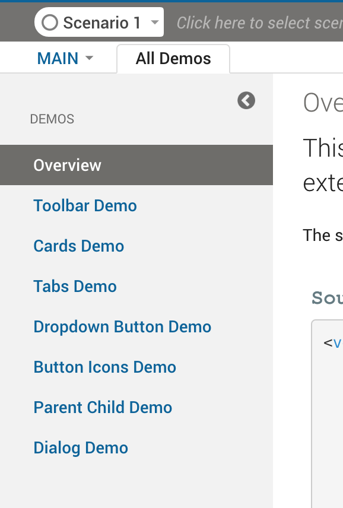

# VDL Custom Extension
## vdlx-sidebar
#### A vertical sidebar menu that has child tags to enable subview switching within a VDL view



A VDL Custom Extension that provides a vertcial sidebar menu. Further custom extensions enable the developer to menu items (subviews), headings and dividers.

```html
<vdlx-sidebar>
    <vdlx-sidebar-header>Menu Heading<vdlx-sidebar-header>
    <vdlx-sidebar-section heading="Overview">
        <!-- view content in here -->
    </vdlx-sidebar-section>
    <vdlx-sidebar-divider></<vdlx-sidebar-divider>
    <vdlx-sidebar-section heading="Overview">
        <vdl-include src="included-view.vdl" />
    </vdlx-sidebar-section>
</vdlx-sidebar>
```