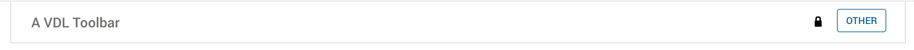

# VDL Custom Extension
## vdlx-toolbar
#### A horizontal panel that holds a title and a number of other VDL extensions.



A VDL custom extension that provides a toolbar panel that stratches across the full width og its parent container.
The title is provided by the `caption` attribute. The active content is provided as child components.

#### Usage
```html
<vdlx-toolbar heading="A VDL Toolbar">
    <button class="btn"></button>
    <button class="btn btn-primary">Other</button>
</vdlx-toolbar>
```
